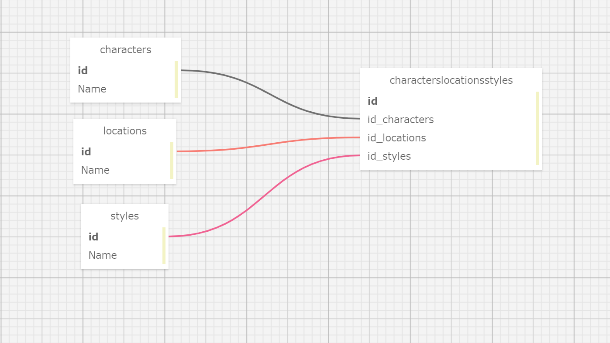

# _Breath of the Wild Database Project_

#### _Many to Many Database Relationship Practice for Epicodus_ 
#### _DATE 01.06.2021_

#### By _**Tawnee Harris, Patrick Osten and Jerrod Styrk**_

## Description

This application will allow users to create instances of Zelda Breath of the Wild Characters, Locations, and Styles and create many to many relationships betweens these instances. 

## Setup/Installation Requirements

Software Requirements
* An internet browser of your choice; I prefer Chrome
* A code editor; I prefer VSCode
* .NET Core
* MySQL
* MySQL Workbench

Open by Downloading or Cloning
* Navigate to <https://github.com/tawneeh/BOTW.Solution.git>
* Download this repository to your computer by clicking the green Code button and 'Download Zip'
* Or clone the repository

AppSettings
* This project requires an AppSettings file. Create your `appsettings.json` file in the main `BOTW` directory. 
* Format your `appsettings.json` file as follows including your unique password that was created at MySqlWorkbench installation:
```
{
  "ConnectionStrings":{
      "DefaultConnection": "Server=localhost;Port=3306;database=botw;uid=root;pwd=<YourPassword>;"
  }
}
```
* Update the Server, Port, and User ID as needed.

Import Database using Entity Framework Core
* Navigate to UniversityRegistrar.Solution/UniversityTracker and type `dotnet ef migrations add <MigrationName>` into the terminal
* Then, type `dotnet ef database update` into the terminal to create your database tables.

DB SQL Schema Snippet
* Paste this Schema Create Statement into your SQL Workbench to create this database and its tables.
```
CREATE DATABASE `botw` /*!40100 DEFAULT CHARACTER SET utf8mb4 COLLATE utf8mb4_0900_ai_ci */ /*!80016 DEFAULT ENCRYPTION='N' */;
CREATE TABLE `__efmigrationshistory` (
  `MigrationId` varchar(95) NOT NULL,
  `ProductVersion` varchar(32) NOT NULL,
  PRIMARY KEY (`MigrationId`)
) ENGINE=InnoDB DEFAULT CHARSET=utf8mb4 COLLATE=utf8mb4_0900_ai_ci;
CREATE TABLE `characterlocationstyle` (
  `CharacterLocationStyleId` int NOT NULL AUTO_INCREMENT,
  `CharacterId` int NOT NULL,
  `LocationId` int DEFAULT NULL,
  `StyleId` int DEFAULT NULL,
  PRIMARY KEY (`CharacterLocationStyleId`),
  KEY `IX_CharacterLocationStyle_CharacterId` (`CharacterId`),
  KEY `IX_CharacterLocationStyle_LocationId` (`LocationId`),
  KEY `IX_CharacterLocationStyle_StyleId` (`StyleId`),
  CONSTRAINT `FK_CharacterLocationStyle_Characters_CharacterId` FOREIGN KEY (`CharacterId`) REFERENCES `characters` (`CharacterId`) ON DELETE CASCADE,
  CONSTRAINT `FK_CharacterLocationStyle_Locations_LocationId` FOREIGN KEY (`LocationId`) REFERENCES `locations` (`LocationId`) ON DELETE RESTRICT,
  CONSTRAINT `FK_CharacterLocationStyle_Styles_StyleId` FOREIGN KEY (`StyleId`) REFERENCES `styles` (`StyleId`) ON DELETE RESTRICT
) ENGINE=InnoDB AUTO_INCREMENT=29 DEFAULT CHARSET=utf8mb4 COLLATE=utf8mb4_0900_ai_ci;
CREATE TABLE `characters` (
  `CharacterId` int NOT NULL AUTO_INCREMENT,
  `Name` longtext,
  PRIMARY KEY (`CharacterId`)
) ENGINE=InnoDB AUTO_INCREMENT=12 DEFAULT CHARSET=utf8mb4 COLLATE=utf8mb4_0900_ai_ci;
CREATE TABLE `locations` (
  `LocationId` int NOT NULL AUTO_INCREMENT,
  `Name` longtext,
  PRIMARY KEY (`LocationId`)
) ENGINE=InnoDB AUTO_INCREMENT=11 DEFAULT CHARSET=utf8mb4 COLLATE=utf8mb4_0900_ai_ci;
CREATE TABLE `styles` (
  `StyleId` int NOT NULL AUTO_INCREMENT,
  `Name` longtext,
  PRIMARY KEY (`StyleId`)
) ENGINE=InnoDB AUTO_INCREMENT=10 DEFAULT CHARSET=utf8mb4 COLLATE=utf8mb4_0900_ai_ci;

```

SQL Database Design
<center>

</center>

Launch this Application
* Navigate to BOTW.Solution/BOTW and type `dotnet restore` into the terminal
* Then, in the same project folder, type `dotnet build` into the terminal followed by `dotnet run`
* Peruse this application at your leisure

## Known Bugs

This application has no known bugs. 

## Support and contact details

* Please feel free to reach out to Tawnee anytime at <tawneeh@icloud.com> 
* Or Patrick Osten at <posten.coding@gmail.com>
* Or Jerrod Styrk at <jstyrk@citadel.edu>

## Technologies Used

* [Bootstrap Components](https://getbootstrap.com/docs/3.3/components/)
* C#
* Razor
* Entity Framework Core
* MySql
* MySql Workbench

### License

[](https://opensource.org/licenses/MIT)

Copyright (c) 2020 **_Tawnee Harris, Patrick Osten and Jerrod Styrk_**

Co-authored-by: Jerrod Styrk <jstyrk@citadel.edu>
Co-authored-by: Patrick Osten <posten.coding@gmail.com>